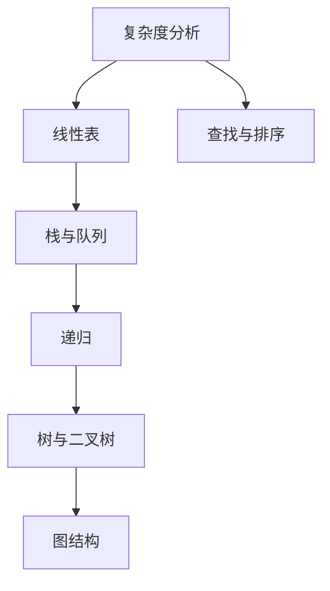

# 数据结构课程大纲

## 课程定位

《数据结构》面向计算机类、软件工程和人工智能相关专业学生，重点帮助学生建立“数据组织方式 + 算法操作 + 复杂度分析”的整体认知。课程既服务期末考试，也服务后续算法、数据库、操作系统和人工智能课程学习。

## 章节结构

| 章节 | 主题 | 难度 | 先修要求 |
| --- | --- | --- | --- |
| 01 | 数据结构与算法复杂度基础 | 入门 | 基础语法 |
| 02 | 线性表、链表与顺序表 | 中等 | 数组、指针或引用 |
| 03 | 栈、队列与递归 | 中等 | 线性表 |
| 04 | 树、二叉树与遍历 | 中等 | 递归、栈与队列 |
| 05 | 图结构与图算法入门 | 较难 | 树、队列、递归 |
| 06 | 查找与排序 | 中等 | 数组、复杂度分析 |

## 知识依赖关系

## 个性化资源生成目标

- 针对考试目标生成重点讲义和速记表
- 针对薄弱点生成链表、栈、树、图等专项练习
- 针对代码能力弱的学生生成 Python/C 伪代码案例
- 针对图解偏好的学生生成遍历过程图和 Mermaid 结构图
- 根据错题反馈动态推荐章节复习顺序
